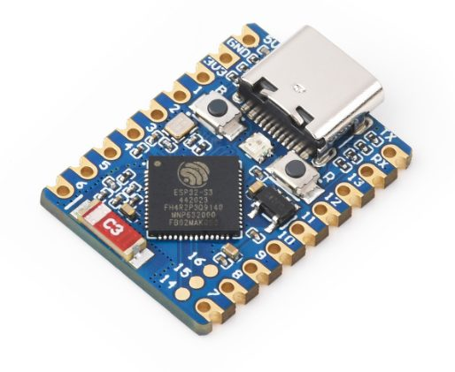

# ESP32-S3-Zero（Waveshare）

[English](README.md) | [中文文档](README.zh.md)

[](https://github.com/Mi-Bee-Studio/esp32-s3-zero/actions/workflows/build.yml)



主板目录规范的第一块板。**本目录按“主板为根”规范组织**：

```
esp32-s3-zero/
├── README.md          # 本文件：这块板的一切硬件信息
└── <project>/         # 每个用这块板做的项目一个目录
    ├── CMakeLists.txt / main/ / sdkconfig.defaults / main/idf_component.yml
    └── README.md      # 项目说明 + 编译/烧录命令
```

规范要点：

- **主板目录名** = 板子名（kebab-case），根 README 只写硬件、不写业务；
- **项目目录独立可编译**：自带完整 ESP-IDF 工程三件套（顶层 CMakeLists、
  `main/`、`sdkconfig.defaults`），`cd <project> && idf.py build` 即出固件；
- 项目间不共享代码；需要共性时先拷贝，稳定后再考虑抽组件。

### 固件基线规范（全家桶强制）

两条基线对所有 MiBee 固件仓强制执行，主板仓内**每个项目**都必须满足
（本仓的板子概要/引脚位置图格式也是全家桶文档标准——**USB-C 朝上、正面/元件面视角**）：

1. **看门狗：必须启用**。不允许裸奔主循环——任务要么订阅 ESP-IDF 任务看门狗
   （TWDT）按周期喂狗，要么（RP2040）启用硬件看门狗；
2. **Web/API 固件升级（OTA）：硬件允许则必须提供**。本板有 WiFi、4MB flash
   （双 1.9MB OTA 槽），故每个项目都要带 web/API 升级能力；有线烧录
   （serialtap/esptool）是兜底恢复手段，不能替代 OTA。

| 项目 | 看门狗 | Web/API OTA |
|------|--------|-------------|
| blink | ✅ 任务 WDT（`esp_task_wdt_init`） | ✅ `POST /ota` 流式写槽（切槽 + 回滚） |
| env-station | ✅ 独立 web 看门狗任务 | ✅ 板端 Web 维护页（配网/OTA） |

---

## 板子概要

| 项目 | 值 |
|------|-----|
| 模组/芯片 | ESP32-S3FH4R2 —— Xtensa LX7 双核 240MHz |
| Flash | 4MB（芯片内封装） |
| PSRAM | 2MB Octal（芯片内封装；**GPIO33–37 被它占用，未引出**） |
| 无线 | 2.4GHz WiFi b/g/n + Bluetooth 5 (LE) |
| USB | **原生 USB Type-C（USB-Serial-JTAG），无 USB-UART 桥芯片** |
| UART0 | TX=GPIO43, RX=GPIO44 |
| 板载 LED | **WS2812 RGB，GPIO21**（可寻址，无有效电平概念） |
| 按键 | BOOT=GPIO0（按住进下载）、RESET |
| 供电 | 3.3V LDO（ME6217C33M5G，800mA）；5V 焊盘输入 3.7–6V，建议 ≥500mA |
| 引出 | 正面两排半孔 2×9（18 孔）＋ 背面错位半孔一排（8 孔）＋ 焊盘 3 个（IO14/15/16）；合计 24 个用户 GPIO |
| 尺寸 | 18.00 × 23.50 mm（USB-C 稍突出） |

## 引脚位置图（USB-C 朝上，正面/元件面视角）

```
                 ┌─ USB-C ─┐
        5V ◎┬───┘  [WS2812]├───┬◎ TX      ← TX = IO43
       GND ◎│      (IO21)  │   ◎ RX      ← RX = IO44
       3V3 ◎│ [BOOT] [RST] │   ◎ 13
       IO1 ◎│    ┌────┐    │   ◎ 12
       IO2 ◎│    │S3  │    │   ◎ 11        14/15/16：
       IO3 ◎│    │FH4R2    │   ◎ 10        板上焊盘（非排孔，
       IO4 ◎│    └────┘    │   ◎ 9         需焊接/顶针接触）
       IO5 ◎│ [C3 电源区]  │   ◎ 8
       IO6 ◎│              │   ◎ 7
            └──────────────┘
             左排（正面）    右排（正面）

  背面（丝印面）在长边半孔的间隙里还有一排错位半孔，自 USB 端起：
  IO45 · IO42 · IO41 · IO40 · IO39 · IO38 · IO18 · IO17
  （IO45 为 strapping 脚；使用前核对背面丝印）
```

要点：

- 正面**左排**（自 USB 端向下）：`5V, GND, 3V3, IO1, IO2, IO3, IO4, IO5, IO6`；
- 正面**右排**（自 USB 端向下）：`TX, RX, IO13, IO12, IO11, IO10, IO9, IO8, IO7`；
- **背面错位排**：`IO45, IO42, IO41, IO40, IO39, IO38, IO18, IO17`（在正面排孔
  的间隙中，焊排针时注意正反面都焊）；
- IO14/15/16 只有圆形焊盘；IO0 = BOOT 按键；IO21 = WS2812；IO19/20 = USB；
- IO33–37 未引出（Octal PSRAM 占用）。

## 注意事项

- **无 USB-UART 桥**：串口就是 S3 的 USB-Serial-JTAG。open 后的 DTR/RTS
  行为与 C3 一致（serialtap 已按此处理：open 后立即释放 DTR/RTS 防复位脉冲）。
- **进下载模式**：板上没有自动下载电路 —— 按住 BOOT 再插 USB/按 RESET。
  但经 serialtap 代理刷机时 esptool 会自动尝试复位进 ROM，通常无需手动按。
- GPIO19/20 是 USB D-/D+，别挪作他用；GPIO0 是 BOOT 按键，上电状态决定启动模式，
  可作输入用但注意上电电平。
- GPIO35–37（PSRAM）与 GPIO43/44（UART0）建议避开。
- **⚠ PSRAM 实测（2026-09-22）**：标称 Octal 2MB，但本机（芯片 v0.2，
  2021-03 ROM）`SPIRAM_MODE_OCT` 初始化在 80M **和 40M** 下都直接
  `octal_psram: PSRAM chip is not connected, or wrong PSRAM line mode` →
  abort → 77ms boot-abort 循环，随后总线级挂死（软复位无效，只能断电）。
  esptool 报 "Embedded PSRAM 2MB (AP_3v3)"，即硅片认为有内封 PSRAM，
  但 Octal 布线初始化不过——**在查清前本项目一律 `CONFIG_SPIRAM=n`**。
  Quad 模式待测。教训：这种挂死会让 USB 完全消失，恢复流程见
  env-station 的 catch-flash 方案（免 BOOT：断电重插 + 守窗口停靠下载模式）。

## 与 serialtap（中间层）的适配点

- 插 USB 后按 USB-Serial-JTAG 枚举，设备名形态与 C3 相同（如 `esp32s3-jtag`），
  serialtap 现有的发现/命名/采集/透传/刷机链路应直接可用 —— 待真机接入验证；
- 4MB flash 刷写耗时约为 C3 感知终端（~1.4MB）的同量级，刷机里程碑事件流可直接复用；
- WS2812（GPIO21）可做“设备状态灯”，未来可让 serialtap/homepulse 通过代理
  下发颜色指令（板端项目实现）。

## 项目索引

| 项目 | 说明 |
|------|------|
| [blink](blink/README.zh.md) | 基线工程：WS2812 心跳彩灯 + BOOT 键换色 + 心跳日志（首个按本规范落地的项目） |
| [env-station](env-station/README.zh.md) | 环境小站（v3.0，含 blackbox 网络探测）：0.96" SSD1306 + 左右按钮 + DHT22（IO3）+ WiFi CSI 人体感应；板端 Web 维护页（配网/OTA）+ 看门狗；WFP 协议 v3/v3.1 首个实现板（零配置发现/握手/本地自治/阈值学习），见其 README |
